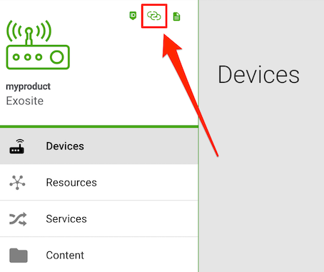

# About Murano MQTT C Sample

This example shows how to create a basic connection to the Exosite Murano Platform using MQTT and the open source paho-mqtt library.

Note: A free account and product at Murano is required: http://info.exosite.com/platform-sign-up

License is BSD, Copyright 2018, Exosite LLC (see LICENSE file)

Tested on Ubuntu 17.10

## Help
Troubleshooting information and help can be in the Exosite Community Forum.

[Community Forum](https://community.exosite.com/)


## Installing

First install the paho-mqtt library and compile on your system. Ensure you've got git and a c compiler installed.

```
git clone https://github.com/eclipse/paho.mqtt.c.git
cd paho.mqtt.c
make
sudo make install
```

**NOTE:** Some errors may occur during installation.

Once the paho-mqtt library is installed you can go ahead and compile this example:

## Configuration

In order to use the `activate` and `publish` examples, you'll first need to set some `#defines` in the respective `.c` files.

### Murano Hostname

Open the Murano Product web UI and click the link that the image (below) is pointing to. This copies the Murano Product hostname into your clipboard.



In both `activate` and `publish` examples, you will trim some characters from this URL to define the MQTT secure host to Murano.

Example using hostname `mqtt://f5330e4s8cho0000.m2.exosite.io/`:

```
#define ADDRESS     "ssl://f5330e4s8cho0000.m2.exosite.io:8883"
```

**NOTE:** This example uses port `8883`. If you changed this to `443` in your Murano Product Settings, then do so in the `ADDRESS` as well.

## Publish Example

In this configuration the paho-mqtt example is sending data to a pre-created product instance on Exosite Murano. To change it to your own instance open publish.c and change the constants to point to your product id and a valid device token:

```
#define ADDRESS     "ssl://<YOUR_PRODUCT_ID_HERE>.m2.exosite.io:443"
#define TOKEN       "<YOUR_DEVICE_TOKEN_HERE>"
```


```
make
./publish
```
